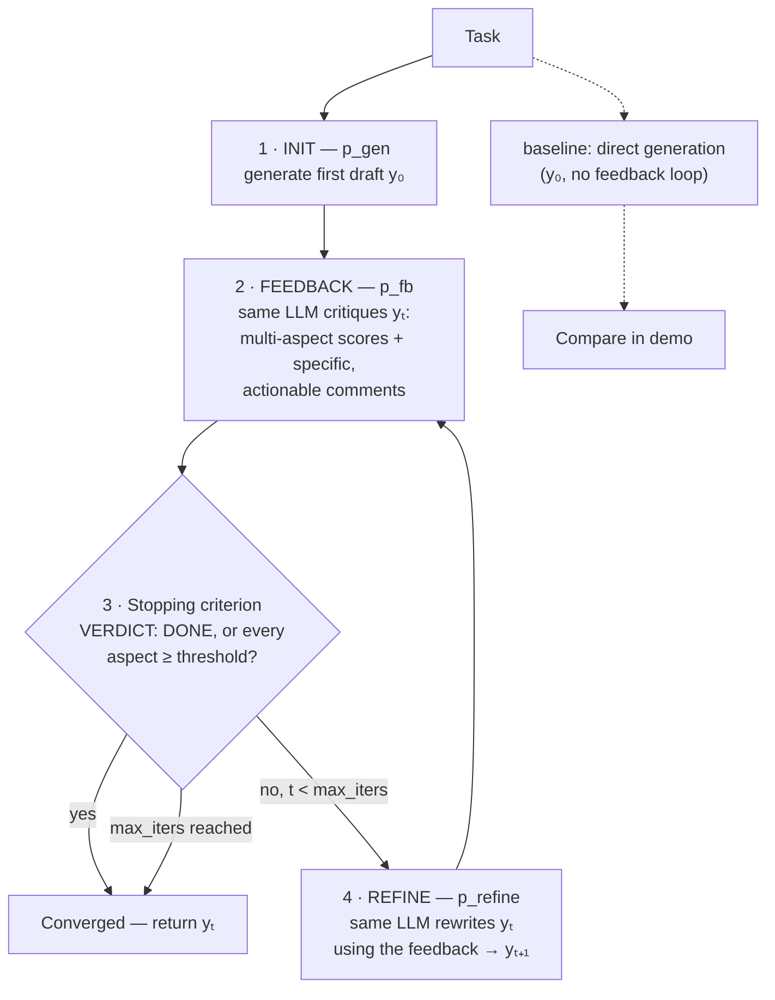

# self-refine

A runnable Python implementation of **Self-Refine** — *"Self-Refine: Iterative Refinement with Self-Feedback"* (Madaan et al., NeurIPS 2023, [arXiv:2303.17651](https://arxiv.org/abs/2303.17651)).

Self-Refine's big idea: the first draft is never the best draft — not for humans, and not for LLMs. Instead of accepting a single generation, use **the same LLM three times**: once to generate an initial output, once to **critique its own output with specific, actionable feedback**, and once to **refine the output using that feedback**. Repeat until the feedback finds nothing left to fix. No training, no reward model, no human labels — just inference-time iteration.

The paper's headline result: across 7 diverse tasks (dialogue, code optimization, math reasoning, …), Self-Refine outputs were preferred over one-shot generation by **~20% absolute**, even on top of GPT-4. Its sharpest ablation: *specific* feedback ("recompute 3/4 × 420 = 315") drives the gains; *generic* feedback ("improve this") barely helps.

This repo implements the full loop, running **100% offline** with a deterministic scripted mock LM (an OpenAI-compatible backend hook is included for real runs).

## Quickstart

```bash
pip install -r requirements.txt
python examples/run_demo.py   # no API key, no network
pytest -q                     # 24 tests
```

Sample output:

```
### Bakery arithmetic  [math reasoning]

  direct generation (y0, score 6.0/10):
    Total = 240 + 180 = 420 loaves.
    Sold = 3/4 x 420 = 310 loaves.
    Remaining = 420 - 310 = 110 loaves.

  self-refined  (y1, score 10.0/10, 1 refinement):
    Total = 240 + 180 = 420 loaves.
    Sold = 3/4 x 420 = 420 * 3 / 4 = 315 loaves.
    Remaining = 420 - 315 = 105 loaves.

  score trajectory: 6.0 -> 10.0
  converged: True

average quality gain from self-refinement: +3.7/10
```

## How it works



One backend object plays all three roles — exactly the paper's setup (section 2: a single LLM as generator, feedback provider, and refiner).

## Usage

```python
from selfrefine import SelfRefine, builtin_tasks, scripted_mock

tasks = builtin_tasks()
task = tasks[0]

# Offline: deterministic scripted mock LM (seeded ladders, no network)
trace = SelfRefine(scripted_mock(tasks)).run(task.id, task.description)

print(trace.initial_output)   # y0 — the direct-generation baseline
print(trace.final_output)     # y_t — the refined result
print(trace.score_trajectory) # e.g. [6.0, 10.0] — the quality climb
print(trace.converged)        # True if feedback declared DONE

# Real run: any OpenAI-compatible endpoint (needs network + key)
from selfrefine import OpenAILM
import os
real = SelfRefine(OpenAILM(model="gpt-4o-mini", api_key=os.environ["OPENAI_API_KEY"]))
trace = real.run("my-task", "Summarize this paragraph in one sentence: ...")
```

Tuning knobs on `SelfRefine(backend, max_iters=4, score_threshold=8.0)`:

- `max_iters` — max feedback/refine rounds (the paper caps at 4).
- `score_threshold` — the quality bar per aspect; the loop stops early once every scored aspect reaches it. This is the paper's task-specific stopping criterion (§2.3) made concrete.

Inspect the feedback itself:

```python
from selfrefine import parse_feedback, feedback_specificity, needs_refinement

fb = parse_feedback(model_output)
print(fb.aspects)                    # [Aspect(name, score, comment), ...]
print(feedback_specificity(fb))      # 0..1 — how actionable the critique is
print(needs_refinement(fb))          # the stopping check
```

## Paper → code mapping

| Paper concept | Where it lives |
|---|---|
| `p_gen` — initial generation (§2, Alg. 1) | `prompts.build_init_prompt`, `refiner.SelfRefine.run` step 1 |
| `p_fb` — self-feedback, multi-aspect, *specific & actionable* (§2.2, §4 ablations) | `prompts.build_feedback_prompt`, `feedback.Feedback` / `parse_feedback` |
| `p_refine` — refine using the feedback (§2, Alg. 1) | `prompts.build_refine_prompt` |
| Task-specific stopping criterion (§2.3) | `feedback.needs_refinement` (DONE verdict or all aspects ≥ threshold) |
| Same LLM for all three roles (§2) | `llm.LLMBackend` — one backend passed to `SelfRefine` |
| Specific-vs-generic feedback ablation (§4) | `feedback.feedback_specificity` + tests |
| Max 4 feedback/refine iterations (§3) | `SelfRefine(max_iters=4)` |
| Full trace of the loop | `refiner.RefinementTrace` (iterations, scores, convergence) |

## Layout

```
selfrefine/
  __init__.py    public API
  llm.py         LLMBackend protocol, ScriptedMockLM (offline), OpenAILM
  prompts.py     p_gen / p_fb / p_refine prompt builders
  feedback.py    Feedback parsing, stopping criterion, specificity metric
  refiner.py     the SelfRefine generate→feedback→refine loop + trace
  tasks.py       demo tasks with scripted improvement ladders
examples/
  run_demo.py    offline demo: direct generation vs self-refined
tests/
  test_self_refine.py   24 tests, all offline
```

## Design notes

- **The mock is honest.** `ScriptedMockLM` only ever sees prompt *text* — it parses the `<<SELFREFINE:TASK_ID:...>>` / `[PHASE: ...]` markers the prompt builders embed, exactly like a real backend would. It never touches the task object, so the loop mechanics (parsing, stopping, refinement) are exercised for real.
- **Fail safe on unparseable feedback.** If the critique can't be parsed into aspects, the loop keeps iterating rather than silently declaring victory (`needs_refinement` returns `True`).
- **No dependencies** beyond pytest. The OpenAI-compatible backend uses only the stdlib.

## Citation

```bibtex
@inproceedings{madaan2023selfrefine,
  title     = {Self-Refine: Iterative Refinement with Self-Feedback},
  author    = {Madaan, Aman and Tandon, Niket and Gupta, Prakhar and Hallinan, Skyler
               and Gao, Luyu and Wiegreffe, Sarah and Alon, Uri and Dziri, Nouha
               and Prabhumoye, Shrimai and Yang, Yiming and Gupta, Shashank
               and Majumder, Bodhisattwa Prasad and Hermann, Katherine and Welleck, Sean
               and Yazdanbakhsh, Amir and Clark, Peter},
  booktitle = {Advances in Neural Information Processing Systems},
  year      = {2023}
}
```

## License

MIT — see [LICENSE](LICENSE).
